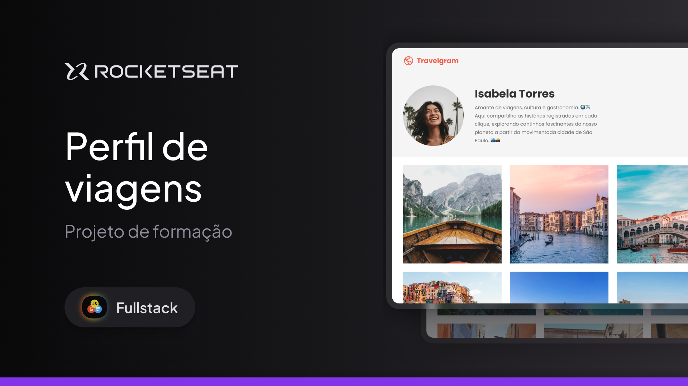

  

  Projeto de um perfil de rede social para viagens, desenvolvido como parte da formação Fullstack da Rocketseat.

  <a href="#-tecnologias-usadas">Tecnologias Usadas</a>&nbsp;&nbsp;&nbsp;|&nbsp;&nbsp;&nbsp;
  <a href="#-projeto">Projeto</a>&nbsp;&nbsp;&nbsp;|&nbsp;&nbsp;&nbsp;
  <a href="#memo-licença">Licença</a>

  

 

  

---

## 🚀 Tecnologias Usadas

Este projeto foi desenvolvido com foco em práticas de front-end, utilizando os seguintes recursos:

- Estruturação de páginas com **HTML**
- Estilização avançada com **CSS**
- Componentes visuais inspirados em redes sociais
- Tipografia e ícones
- Layout responsivo
- Design limpo e moderno

## 💡 Projeto

O **Perfil de Viagens** é um projeto proposto na trilha de formação Fullstack da Rocketseat, com o objetivo de desenvolver a interface de uma rede social voltada para compartilhamento de fotos e experiências de viagem.

Durante a construção, aplicamos conhecimentos de HTML e CSS para criar um layout responsivo, utilizando boas práticas de design e desenvolvimento web.

## :memo: Licença

Este projeto está sob a licença MIT. 
